# Ansible playbook: labocbz.deploy_elk


## Description


An Ansible playbook to deploy and configure an ELK stack on your hosts.

This playbook facilitates the deployment of the ELK Stack, which includes Elasticsearch, Logstash, and Kibana. It seamlessly manages SSL and mTLS communication between each component but requires you to have the necessary certificates in advance.

Additionally, the playbook handles the configuration of interfaces, allowing you to set up a reverse proxy in front of Kibana for enhanced interface protection. Each component is installed using a boolean variable, such as inv_install_kibana: true. This flexibility enables you to deploy the ELK Stack on a single machine or multiple machines, offering the option of decentralizing Kibana or Logstash as needed.

With this playbook, you can efficiently set up and configure the ELK Stack, enhancing your ability to manage and analyze log data, while ensuring secure communication and deployment options.

## Deployment diagramm



This showcases a potential deployment realized using this playbook. We can observe an ELK service component, which is divided into four subsystems: Apache2 (reverse proxy), Logstash, Elasticsearch (Elastic), and Kibana. It's worth noting that the Elastic component is installed in the form of a three-machine cluster. Each node communicates with the others via mTLS. Both the Logstash and Kibana components are also configured with mTLS and Basic Auth (Logstash is responsible for ingesting logs into Elasticsearch and Kibana for its configuration). Please note that while it's possible to create special accounts for Kibana and Logstash within Elasticsearch, this functionality is not natively managed by the playbook. The playbook doesn't create accounts; it simply changes the password to the one provided as a parameter. You could consider a workflow where you install the entire stack, create the accounts, and then deploy the stack without reinstalling Elasticsearch (as the playbook removes data to start or bootstrap the cluster).

## Tests and simulations

### Basics

You have to run multiples tests. *tests with an # are mandatory*

```MARKDOWN
# syntax
# converge
# idempotence
# verify
side_effect
```

Executing theses test in this order is called a "scenario" and Molecule can handle them.

Molecule use Ansible and pre configured playbook to create containers, prepare them, converge (run the playbook) and verify its execution.
You can manage multiples scenario with multiples tests in order to get a 100% code coverage.

This playbook contains a ./tests folder. In this folder you can use the inventory or the tower folder to create a simualtion of a real inventory and a real AWX / Tower job execution.

### Command reminder

```SHELL
# Check your YAML syntax
yamllint -c ./.yamllint .

# Check your Ansible syntax and code security
ansible-lint --config=./.ansible-lint .

# Execute and test your playbook
molecule create
molecule list
molecule converge
molecule verify
molecule destroy

# Execute all previous task in one single command
molecule test
```

## Installation

To install this playbook, just copy/import this playbook or raw file into your fresh playbook repository or call it with the "include_playbook/import_playbook" module.

## Usage

### Vars

```YAML
# From inventory
---
# all vars from to put/from your inventory
# see tests/inventory/group_var for all groups and vars.
```

```YAML
# From AWX / Tower
---
all vars from to put/from AWX / Tower
```

## Architectural Decisions Records

Here you can put your change to keep a trace of your work and decisions.

### 2023-10-22: First Init

* First init of this playbook with the bootstrap_playbook playbook by Lord Robin Crombez
* Playbook deploy ELK
* Playbook deploy Elasticsearch
* Playbook deploy Logstash
* Playbook deploy Kibana
* Playbook deploy Apache2 as reverse proxy ssl / Auth

### 2023-10-30: Doc

* Added readme
* Added diagram

### 2023-12-18: Tested, Iptables

* Iptables added to block Kibana without Apache if enabled

### 2023-03-07: Refacto, fixes

* Refacto vars
* Fix Kibana SSL
* Tested and added support for Debian 11/12 and Ubuntu 22

### 2024-05-19: New CI

* Added Markdown lint to the CICD
* Rework all Docker images
* Change CICD vars convention
* New workers
* Removed all automation based on branch

### 2024-05-22: CI for non cluser

* CI is designed (var only) for single instance tests

## Authors

* Lord Robin Crombez

## Sources

* [Ansible playbook documentation](https://docs.ansible.com/ansible/latest/playbook_guide/playbooks_reuse_playbooks.html)
* [Ansible Molecule documentation](https://molecule.readthedocs.io/)
